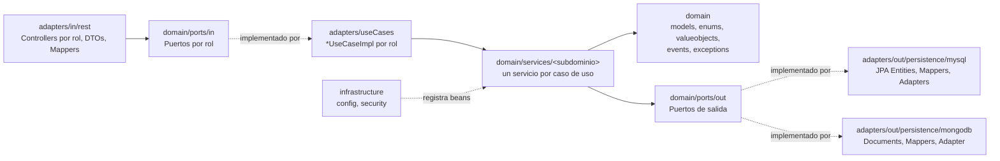
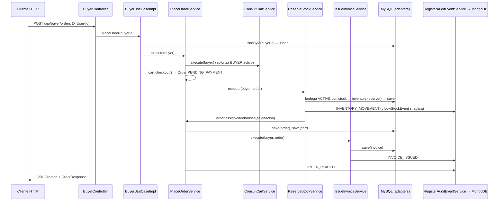

# Software Architecture - NexusMarket

## 1. Visión general
NexusMarket es un marketplace con inventario distribuido en bodegas. Su backend sigue una **Arquitectura Hexagonal (Ports & Adapters)** combinada con **Domain-Driven Design (DDD)**.

El objetivo es aislar las reglas del negocio de las tecnologías externas: Spring, MySQL, MongoDB y HTTP. Así el dominio se puede probar sin base de datos ni servidor web, y la tecnología se puede cambiar sin tocar el negocio.

**Stack tecnológico**

| Componente | Tecnología |
|---|---|
| Lenguaje | Java 17 |
| Framework | Spring Boot 4.1 |
| API | Spring Web MVC (REST / JSON) |
| Persistencia relacional | MySQL 8, vía Spring Data JPA |
| Auditoría NoSQL | MongoDB, vía Spring Data MongoDB (colección `audit_logs`) |
| Seguridad | Spring Security + BCrypt (JWT en una etapa posterior) |
| Pruebas | JUnit 5 |
| Build | Maven (wrapper `mvnw`) |

## 2. Principios
1. **Dominio primero:** el negocio se modela antes que la tecnología.
2. **Inversión de dependencias:** el dominio define interfaces (puertos) y la infraestructura las implementa.
3. **Dominio libre de frameworks:** `application.domain` no importa Spring, JPA, Lombok ni Jackson.
4. **Modelo rico:** las entidades protegen sus invariantes con métodos de negocio, no con setters.
5. **Tipos fuertes:** los estados, roles y tipos son enums, y los valores con reglas son Value Objects.

## 3. Capas y dependencias



La regla de dependencia es que **las flechas siempre apuntan hacia el dominio**. El dominio no conoce a ningún adaptador.

## 4. Estructura de paquetes

```
nexusm/src/main/java/application/
├── NexusmarketApplication.java
├── domain/                              ← NÚCLEO (sin frameworks)
│   ├── models/        User, Buyer, Seller, Warehouse, Product, Inventory,
│   │                  InventoryMovement, Cart, CartItem, Order, OrderItem,
│   │                  Invoice, Shipment, ReturnRequest, Refund
│   ├── enums/         UserRole, UserStatus, SellerStatus, ProductType, ProductStatus,
│   │                  WarehouseStatus, MovementType, OrderStatus, InvoiceStatus,
│   │                  ShipmentStatus, ReturnStatus, RefundStatus, OperationType
│   ├── valueobjects/  Email, PhoneNumber, Address, IdentificationNumber, Money,
│   │                  Quantity, Percentage, ProductCode, DateRange,
│   │                  WarehouseLocation, *Id
│   ├── services/      DomainService (anotación propia)
│   │   ├── authorization/  Validate*/Authorize*Service
│   │   ├── audit/          RegisterAuditEventService
│   │   ├── user/           Register*, Approve/SuspendSeller, Block/ActivateUser, ConsultUser…
│   │   ├── product/        CreateProduct, ChangeProductPrice, Suspend/Publish/Discontinue…
│   │   ├── warehouse/      CreateWarehouse, Activate/DeactivateWarehouse, ConsultWarehouse
│   │   ├── inventory/      CreateInventory, ReceiveStock, AdjustStock, AllocateWarehouse,
│   │   │                   ReserveStock, ReleaseStock, RestockReturnedItem…
│   │   ├── cart/           AddItemToCart, ChangeCartItemQuantity, RemoveItemFromCart…
│   │   ├── order/          PlaceOrder, PayOrder, CancelOrder, ConsultOrder
│   │   ├── invoice/        IssueInvoice, ConsultInvoice
│   │   ├── shipment/       CreateShipment, DispatchShipment, ConfirmDelivery…
│   │   ├── returns/        RequestReturn, Approve/RejectReturn, ReceiveReturn…
│   │   ├── refund/         ProcessRefund, ConsultRefund
│   │   └── pricing/        PricingDomainService
│   ├── events/        DomainEvent, BusinessOperationEvent, LowStockEvent
│   ├── exceptions/    DomainException, InsufficientStockException,
│   │                  OrderStateTransitionException, InvalidStatusTransitionException,
│   │                  ResourceNotFoundException, UnauthorizedOperationException,
│   │                  UserAlreadyExistsException
│   └── ports/
│       ├── in/        PublicAccessPort, BuyerPort, SellerPort,
│       │              LogisticOperatorPort, AdminPort, SupervisorPort
│       └── out/       UserRepository, ProductRepository, WarehouseRepository,
│                      InventoryRepository, CartRepository, OrderRepository,
│                      InvoiceRepository, ShipmentRepository, ReturnRequestRepository,
│                      RefundRepository, AuditLogPort
├── adapters/
│   ├── useCases/      PublicAccessUseCaseImpl, BuyerUseCaseImpl, SellerUseCaseImpl,
│   │                  LogisticOperatorUseCaseImpl, AdminUseCaseImpl, SupervisorUseCaseImpl
│   ├── in/rest/       controllers/ (Public, Buyer, Seller, Logistics, Admin, Supervisor),
│   │                  requests/, responses/, mappers/
│   └── out/persistence/
│       ├── mysql/     entities/, repositories/, mappers/, adapters/
│       └── mongodb/   documents/, repositories/, mappers/, adapters/
└── infrastructure/
    ├── config/        ApplicationConfig (escaneo de @DomainService), AdminSeeder
    └── security/      SecurityConfig (BCrypt)
```

## 5. Responsabilidad de cada capa

### 5.1 Dominio (`domain`)
Contiene todo el negocio:
- entidades con comportamiento,
- Value Objects auto-validados,
- enums con máquinas de estado,
- servicios de dominio (uno por caso de uso, en `domain/services/<subdominio>`),
- eventos,
- excepciones.

No tiene ninguna anotación de framework. El detalle está en `SDD/domain/Domain Model.md`, `SDD/domain/Domain Value Objects.md` y `SDD/domain/services/*.md`.

### 5.2 Puertos
- **Puertos de entrada (`ports/in`), uno por rol:** `PublicAccessPort`, `BuyerPort`, `SellerPort`, `LogisticOperatorPort`, `AdminPort` y `SupervisorPort`. Cada uno reúne los casos de uso que ese rol puede ejecutar. Es el mismo criterio del proyecto de referencia (`NaturalCustomerPort`, `TellerEmployeePort`…).
- **Puertos de salida (`ports/out`):** definen lo que el dominio necesita del exterior, es decir, persistencia y auditoría.

### 5.3 Servicios de dominio y casos de uso

Adaptación del patrón del proyecto de referencia:

| Proyecto de referencia (banco) | NexusMarket |
|---|---|
| `domain/services/<subdominio>/<Acción>Service` | Igual: `domain/services/<subdominio>/<Acción>Service` |
| Servicios anotados con `@Service` y Lombok **dentro del dominio** | Servicios en Java puro con la anotación propia `@DomainService`; el dominio no importa Spring |
| `Authorize*Service` / `Validate*Service` | `authorization/`: `AuthorizeAdmin/Supervision/Buyer/Seller/LogisticOperationService`, `ValidateActiveUserService`, `ValidateRoleService`, `Validate*OwnershipService` |
| `RegisterOperationAndAuditService` | `audit/RegisterAuditEventService` + `BusinessOperationEvent` + `OperationType` |
| Puertos de entrada por rol + `adapters/useCases/<Rol>UseCaseImpl` | Igual: seis puertos por rol y seis `*UseCaseImpl` |

**Servicios de dominio (`domain/services`).** Cada clase implementa un solo caso de uso con un método `execute(...)`. Recibe al usuario ejecutor (`User`) y sigue el patrón estándar:
1. autorizar,
2. cargar el estado autoritativo,
3. validar la propiedad y las reglas,
4. ejecutar el comportamiento de la entidad,
5. persistir,
6. auditar.

Están documentados uno a uno en `SDD/domain/services/`.

**Registro sin Spring en el dominio.** `infrastructure/config/ApplicationConfig` declara:

```java
@ComponentScan(basePackages = "application.domain.services",
    includeFilters = @ComponentScan.Filter(type = FilterType.ANNOTATION,
                                           classes = DomainService.class))
```

Así Spring crea un bean por cada clase anotada con `@DomainService` e inyecta sus dependencias por constructor, sin que el dominio conozca a Spring.

**Casos de uso por rol (`adapters/useCases`).** Implementan los puertos de entrada. Cargan al usuario ejecutor a partir del `UserId` de la cabecera `X-User-Id` y delegan en los servicios de dominio. Están anotados con `@Service` y `@Transactional`: una operación que guarda varias entidades (por ejemplo, pedido + inventario + factura) se confirma o se revierte completa en MySQL.

### 5.4 Adaptadores de entrada (`adapters/in/rest`)
- **Controllers (uno por rol):** exponen HTTP y solo dependen del puerto de entrada de su rol.
- **Requests / Responses:** son records (DTOs) desacoplados del dominio.
- **Mappers:** convierten entre DTO y modelo de dominio.
- **GlobalExceptionHandler:** traduce las excepciones de dominio a códigos HTTP.

| Excepción | HTTP |
|---|---|
| `ResourceNotFoundException` | 404 |
| `UnauthorizedOperationException` | 403 |
| `InsufficientStockException`, `OrderStateTransitionException`, `InvalidStatusTransitionException`, `UserAlreadyExistsException`, `IllegalStateException` | 409 |
| `DomainException`, `IllegalArgumentException`, falta la cabecera `X-User-Id` | 400 |

### 5.5 Adaptadores de salida (`adapters/out/persistence`)
Cada adaptador define sus propios **Entities/Documents**, **Mappers** (dominio ↔ entidad) y **Repositories**. Así el dominio nunca ve anotaciones JPA ni MongoDB.

| Puerto | Adaptador | Tecnología | Tabla / colección |
|---|---|---|---|
| `UserRepository` | `UserPersistenceAdapter` | JPA / MySQL | `users` |
| `ProductRepository` | `ProductPersistenceAdapter` | JPA / MySQL | `products` |
| `WarehouseRepository` | `WarehousePersistenceAdapter` | JPA / MySQL | `warehouses` |
| `InventoryRepository` | `InventoryPersistenceAdapter` | JPA / MySQL | `inventory` |
| `CartRepository` | `CartPersistenceAdapter` | JPA / MySQL | `carts`, `cart_items` |
| `OrderRepository` | `OrderPersistenceAdapter` | JPA / MySQL | `orders`, `order_items` (con `warehouse_id`) |
| `InvoiceRepository` | `InvoicePersistenceAdapter` | JPA / MySQL | `invoices` |
| `ShipmentRepository` | `ShipmentPersistenceAdapter` | JPA / MySQL | `shipments` |
| `ReturnRequestRepository` | `ReturnRequestPersistenceAdapter` | JPA / MySQL | `return_requests` |
| `RefundRepository` | `RefundPersistenceAdapter` | JPA / MySQL | `refunds` |
| `AuditLogPort` | `AuditLogPersistenceAdapter` | MongoDB | `audit_logs` |

Los enums se guardan como texto (`name()`) en columnas `VARCHAR`. Los Value Objects se descomponen en columnas: `Money` pasa a `amount` + `currency` y `Address` pasa a cinco columnas.

### 5.6 Infraestructura (`infrastructure`)
- **`ApplicationConfig`** escanea `@DomainService` y registra los servicios de dominio como beans, sin poner `@Service` en el dominio.
- **`AdminSeeder`** crea el primer Administrador al arrancar si no existe ninguno. Los datos se configuran con las propiedades `nexusmarket.admin.*`.
- **`SecurityConfig`** configura BCrypt. En esta etapa la API está abierta, y quien ejecuta una operación restringida se identifica con la cabecera `X-User-Id`. El dominio valida su rol y su estado. En la siguiente etapa esa cabecera se reemplaza por un JWT.

## 6. Flujo de una petición: crear un pedido



## 7. API REST (por rol)

Todas las rutas, excepto las de `/api/public`, requieren la cabecera `X-User-Id` con el id del usuario que ejecuta la operación. El dominio valida su rol y su estado.

| Método | Ruta | Caso de uso (servicio) |
|---|---|---|
| **Público** | | |
| POST | `/api/public/buyers` | `RegisterBuyerService` |
| GET | `/api/public/products?keyword=` | `ConsultProductService.searchCatalog` (solo `PUBLISHED`) |
| GET | `/api/public/products/{id}` | `ConsultProductService.findPublished` |
| **Comprador** | | |
| GET | `/api/buyer/cart` | `ConsultCartService` |
| POST | `/api/buyer/cart/items` | `AddItemToCartService` |
| PATCH / DELETE | `/api/buyer/cart/items/{productId}` | `ChangeCartItemQuantityService` / `RemoveItemFromCartService` |
| POST | `/api/buyer/orders` | `PlaceOrderService` (checkout del carrito) |
| GET | `/api/buyer/orders`, `/api/buyer/orders/{id}` | `ConsultOrderService` |
| PATCH | `/api/buyer/orders/{id}/pay` | `PayOrderService` |
| PATCH | `/api/buyer/orders/{id}/cancel` | `CancelOrderService` |
| GET | `/api/buyer/orders/{id}/invoice` | `ConsultInvoiceService` |
| GET | `/api/buyer/orders/{id}/shipment` | `ConsultShipmentService` |
| POST / GET | `/api/buyer/returns` | `RequestReturnService` / `ConsultReturnService` |
| GET | `/api/buyer/returns/{id}/refund` | `ConsultRefundService` |
| **Vendedor** | | |
| POST / GET | `/api/seller/products` | `CreateProductService` / `ConsultProductService.findBySeller` |
| PATCH | `/api/seller/products/{id}/price` | `ChangeProductPriceService` |
| PATCH | `/api/seller/products/{id}/suspend`, `/publish`, `/discontinue` | `Suspend/Publish/DiscontinueProductService` |
| **Operador Logístico** | | |
| POST | `/api/logistics/inventory` | `CreateInventoryService` |
| PATCH | `/api/logistics/inventory/receive` | `ReceiveStockService` (`INFLOW`) |
| PATCH | `/api/logistics/inventory/adjust` | `AdjustStockService` (`ADJUSTMENT`) |
| GET | `/api/logistics/inventory?warehouseId=` o `?productId=` | `ConsultInventoryService` |
| GET | `/api/logistics/warehouses`, `/api/logistics/orders/{id}` | `ConsultWarehouseService`, `ConsultOrderService` |
| POST | `/api/logistics/shipments` | `CreateShipmentService` |
| PATCH | `/api/logistics/shipments/{id}/dispatch`, `/deliver` | `DispatchShipmentService`, `ConfirmDeliveryService` |
| PATCH | `/api/logistics/returns/{id}/receive` | `ReceiveReturnService` |
| **Administrador** | | |
| POST | `/api/admin/sellers`, `/api/admin/staff` | `RegisterSellerService`, `RegisterStaffUserService` |
| PATCH | `/api/admin/sellers/{id}/approve`, `/suspend` | `ApproveSellerService`, `SuspendSellerService` |
| POST / GET | `/api/admin/warehouses` | `CreateWarehouseService` / `ConsultWarehouseService` |
| PATCH | `/api/admin/warehouses/{id}/activate`, `/deactivate` | `Activate/DeactivateWarehouseService` |
| **Supervisor (o Administrador)** | | |
| GET | `/api/supervisor/users`, `/api/supervisor/users/{id}` | `ConsultUserService` |
| PATCH | `/api/supervisor/users/{id}/block`, `/activate` | `BlockUserService`, `ActivateUserService` |
| GET | `/api/supervisor/orders`, `/api/supervisor/orders/{id}` | `ConsultOrderService` |
| PATCH | `/api/supervisor/orders/{id}/cancel` | `CancelOrderService` |
| PATCH | `/api/supervisor/products/{id}/suspend` | `SuspendProductService` (moderación) |
| GET | `/api/supervisor/returns` | `ConsultReturnService.findAll` |
| PATCH | `/api/supervisor/returns/{id}/approve`, `/reject` | `ApproveReturnService`, `RejectReturnService` |
| POST | `/api/supervisor/returns/{id}/refund` | `ProcessRefundService` |

## 8. Infraestructura local

| Servicio | Puerto | Base de datos |
|---|---|---|
| MySQL | 3306 | `nexusmarket` (el esquema lo genera `ddl-auto=update`) |
| MongoDB | 27017 | `nexusmarket`, colección `audit_logs` |

Se levantan con el archivo `docker-compose.yml` de la raíz del repositorio (`docker compose up -d`).

## 9. Estrategia de pruebas
- **Pruebas de dominio (JUnit 5, sin Spring):**
  - entidades: `OrderTest`, `UserTest`, `ProductTest`, `InventoryTest`, `CartTest`, `PostSaleFlowTest`,
  - enums: `OrderStatusTest`,
  - Value Objects: `MoneyTest`, `QuantityTest`, `EmailTest`, `PercentageTest`, `DateRangeTest`,
  - servicios: `PricingDomainServiceTest`.
- **Pruebas de los servicios de dominio encadenados:** `MarketplaceFlowTest` usa `InMemoryRepositories` (todos los puertos de salida en memoria) y `DomainServiceContainer`. Este último es un mini contenedor que construye cada `@DomainService` por constructor, igual que Spring, y falla si un servicio no tiene exactamente un constructor. Cubre:
  - el flujo completo: carrito → pedido → pago → envío → entrega → devolución → reembolso;
  - la autorización por rol y el usuario bloqueado;
  - la unicidad de correo e identificación;
  - el stock insuficiente y las bodegas inactivas;
  - la cancelación con liberación de stock;
  - la propiedad del pedido y el límite de devolución.
- **Prueba de contexto:** `NexusmarketApplicationTests` levanta Spring completo, por lo que requiere MySQL y MongoDB activos.
