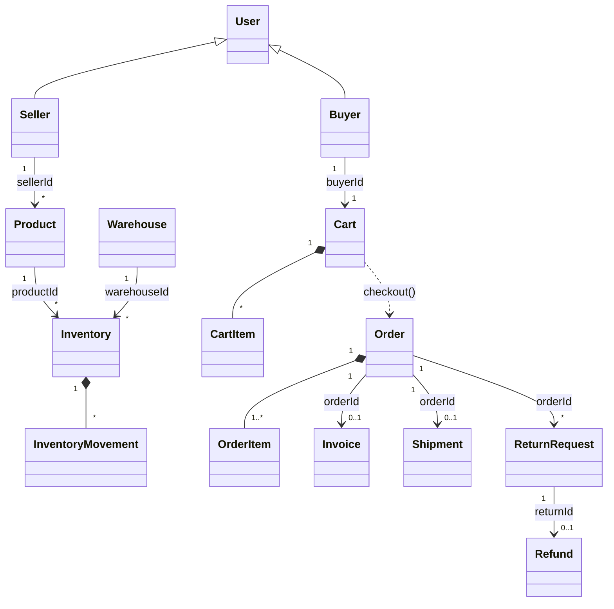
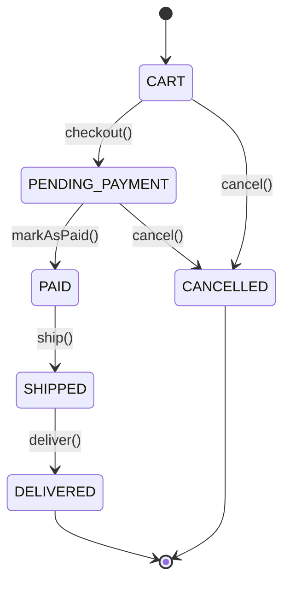

# Domain Model - NexusMarket

## 1. Introducción

### 1.1 Propósito
Este documento especifica el modelo de dominio del marketplace **NexusMarket**. Para cada entidad detalla sus atributos, su comportamiento, sus reglas de negocio y sus validaciones. Las clases Java del paquete `application.domain.models` implementan este modelo **1:1**: mismos nombres, mismos atributos y mismos métodos.

### 1.2 Alcance
El modelo cubre:
- usuarios y roles,
- catálogo de productos (físicos y digitales),
- bodegas e inventario distribuido,
- carrito de compras y pedidos,
- facturación,
- envíos,
- devoluciones y reembolsos.

### 1.3 Convenciones
- El código está 100 % en inglés. La documentación está en español.
- Toda identidad es un Value Object tipado (`UserId`, `ProductId`…) basado en UUID.
- Los estados, roles y tipos son `enum`. **No hay `String` abiertos en campos acotados.**
- Toda regla de negocio que depende solo de la entidad vive dentro de la entidad (modelo rico, no anémico).
- Las reglas que necesitan consultar repositorios (unicidad, roles del ejecutor) viven en los servicios de aplicación.

### 1.4 Conceptos clave

| Concepto | Clase | Tipo DDD |
|---|---|---|
| Usuario | `User` | Entidad (raíz del agregado Usuario) |
| Comprador | `Buyer` | Entidad (especialización de `User`) |
| Vendedor | `Seller` | Entidad (especialización de `User`) |
| Bodega | `Warehouse` | Entidad (raíz) |
| Producto | `Product` | Entidad (raíz) |
| Inventario | `Inventory` | Entidad (raíz) |
| Movimiento de inventario | `InventoryMovement` | Entidad inmutable dentro de `Inventory` |
| Carrito | `Cart` | Entidad (raíz) |
| Línea de carrito | `CartItem` | Entidad interna de `Cart` (inmutable) |
| Pedido | `Order` | Entidad (raíz) |
| Línea de pedido | `OrderItem` | Entidad interna de `Order` (inmutable) |
| Factura | `Invoice` | Entidad (raíz) |
| Envío | `Shipment` | Entidad (raíz) |
| Devolución | `ReturnRequest` | Entidad (raíz) |
| Reembolso | `Refund` | Entidad (raíz) |

---

## 2. Entidades de Dominio

### 2.1 User (entidad base)
**Clase:** `application.domain.models.User`

**Atributos**

| Atributo | Tipo | Mutable | Descripción |
|---|---|---|---|
| id | `UserId` | No | Identidad única |
| identification | `IdentificationNumber` | No | Cédula / NIT / pasaporte, único en la plataforma |
| fullName | `String` | Sí | Nombre completo, obligatorio |
| email | `Email` | No | Correo, único en la plataforma |
| phone | `PhoneNumber` | Sí | Teléfono E.164 |
| role | `UserRole` | No | Único rol del usuario |
| status | `UserStatus` | Sí | `ACTIVE` o `BLOCKED` |
| passwordHash | `String` | Sí | Contraseña cifrada con BCrypt |
| addresses | `List<Address>` | Sí (agregar) | Direcciones del usuario |
| createdAt | `LocalDateTime` | No | Fecha de registro |

**Métodos:**
- De fábrica: `createStaff(identification, fullName, email, phone, role, passwordHash)`.
- De cambio de datos: `changeName`, `changePhone`, `changePasswordHash`, `addAddress`.
- De estado: `block`, `activate`, `isActive`, `requireActive`.
- De rol: `isBuyer`, `isSeller`, `isLogisticOperator`, `isAdmin`, `isSupervisor`.

**Reglas de negocio**
1. Cada usuario tiene **un único rol** (`UserRole`), que no cambia.
2. El email y la identificación son **únicos** en la plataforma. Lo valida `ValidateUserUniquenessService` contra `UserRepository.existsByEmail` y `existsByIdentification`.
3. Un usuario `BLOCKED` no puede operar: `requireActive()` lanza `UnauthorizedOperationException`.
4. `block()` sobre un usuario ya bloqueado, o `activate()` sobre uno activo, lanza `InvalidStatusTransitionException`.
5. `createStaff` solo acepta roles internos: `LOGISTIC_OPERATOR`, `ADMIN` o `SUPERVISOR`.

**Validaciones:** id, identificación, email, teléfono y rol son obligatorios. El nombre no puede estar vacío. Si no se indica estado, nace en `ACTIVE`.

**Identidad:** dos usuarios son iguales si tienen el mismo `id`.

### 2.2 Buyer (extiende User)
**Clase:** `application.domain.models.Buyer`

| Atributo | Tipo | Descripción |
|---|---|---|
| defaultShippingAddress | `Address` | Dirección de envío por defecto (obligatoria) |

**Métodos:** `create(identification, fullName, email, phone, passwordHash, defaultShippingAddress)` y `changeDefaultShippingAddress(address)`.

**Reglas:** el rol siempre es `BUYER`. El registro es público y no requiere Administrador.

### 2.3 Seller (extiende User)
**Clase:** `application.domain.models.Seller`

| Atributo | Tipo | Descripción |
|---|---|---|
| businessName | `String` | Nombre comercial (obligatorio) |
| sellerStatus | `SellerStatus` | `PENDING_APPROVAL`, `APPROVED` o `SUSPENDED` |

**Métodos:** `create(...)`, `approve()`, `suspend()`, `changeBusinessName()`, `isApproved()` y `requireApprovedToPublish()`.

**Reglas**
1. **Solo un Administrador activo puede registrar vendedores.** Lo aplica `RegisterSellerService` con `AuthorizeAdminOperationService`.
2. El vendedor nace en `PENDING_APPROVAL`. Solo un Administrador activo lo aprueba (`approveSeller`).
3. Solo publica productos si está **activo y aprobado** (`requireApprovedToPublish`).
4. Transiciones permitidas:
   - `PENDING_APPROVAL → APPROVED`
   - `APPROVED → SUSPENDED`
   - `SUSPENDED → APPROVED`

### 2.4 Warehouse
**Clase:** `application.domain.models.Warehouse`

| Atributo | Tipo | Descripción |
|---|---|---|
| id | `WarehouseId` | Identidad |
| name | `String` | Nombre, obligatorio |
| address | `Address` | Dirección física |
| location | `WarehouseLocation` | Ubicación de referencia (pasillo/estante/cajón) |
| status | `WarehouseStatus` | `ACTIVE` o `INACTIVE` |

**Métodos:** `create`, `changeName`, `changeAddress`, `changeLocation`, `activate`, `deactivate` e `isActive`.

**Reglas:** solo las bodegas `ACTIVE` participan en la asignación de pedidos (`AllocateWarehouseService`).

### 2.5 Product
**Clase:** `application.domain.models.Product`

| Atributo | Tipo | Mutable | Descripción |
|---|---|---|---|
| id | `ProductId` | No | Identidad |
| code | `ProductCode` | No | SKU único |
| name | `String` | No | Nombre, obligatorio |
| description | `String` | Sí | Descripción |
| price | `Money` | Sí | Precio de venta |
| sellerId | `UserId` | No | Vendedor dueño |
| type | `ProductType` | No | `PHYSICAL` o `DIGITAL` |
| status | `ProductStatus` | Sí | `PUBLISHED`, `SUSPENDED` o `DISCONTINUED` |
| createdAt | `LocalDateTime` | No | Fecha de creación |

**Métodos:** `create`, `changePrice`, `changeDescription`, `publish`, `suspend`, `discontinue`, `isSellable` y `requiresInventory`.

**Reglas**
1. Un producto nace `PUBLISHED`.
2. Transiciones permitidas:
   - `PUBLISHED ↔ SUSPENDED`
   - `PUBLISHED | SUSPENDED → DISCONTINUED`

   `DISCONTINUED` es terminal. Cualquier otra transición lanza `InvalidStatusTransitionException`.
3. Un producto `DISCONTINUED` no admite cambios de precio ni de descripción.
4. Solo los productos `PHYSICAL` manejan inventario en bodega (`requiresInventory`).
5. Solo un vendedor activo y aprobado puede crear productos (`ProductApplicationService.createProduct`).

### 2.6 Inventory
**Clase:** `application.domain.models.Inventory`

| Atributo | Tipo | Descripción |
|---|---|---|
| id | `InventoryId` | Identidad |
| productId | `ProductId` | Producto |
| warehouseId | `WarehouseId` | Bodega |
| onHand | `Quantity` | Unidades disponibles |
| reorderThreshold | `Quantity` | Punto de reorden |
| location | `WarehouseLocation` | Ubicación dentro de la bodega |
| movements | `List<InventoryMovement>` | Movimientos registrados |

**Métodos**

| Método | MovementType | Efecto |
|---|---|---|
| `receive(qty)` | `INFLOW` | Suma |
| `reserve(qty)` | `RESERVATION` | Resta |
| `registerSale(qty)` | `SALE` | Resta |
| `registerReturn(qty)` | `RETURN` | Suma |
| `adjust(delta, reason)` | `ADJUSTMENT` | Suma o resta |

Otros métodos: `isAvailable`, `isBelowReorderPoint`, `changeReorderThreshold` y `getMovements`.

**Reglas**
1. El par (producto, bodega) identifica el inventario de forma única (inventario distribuido).
2. **Prohibición estricta de existencias negativas.** Toda salida mayor al disponible lanza `InsufficientStockException`, y `Quantity` tampoco admite negativos.
3. Todo cambio de stock genera un `InventoryMovement` con su `MovementType`.
4. No se admiten movimientos de cero unidades.

### 2.7 InventoryMovement
**Clase:** `application.domain.models.InventoryMovement` (inmutable)

**Atributos:**
- `id`: `MovementId`
- `inventoryId`: `InventoryId`
- `type`: `MovementType`
- `quantity`: `Quantity`, mayor que 0
- `resultingOnHand`: `Quantity`
- `reason`: `String`
- `occurredAt`: `LocalDateTime`

**Fábrica:** `record(inventoryId, type, quantity, resultingOnHand, reason)`.

### 2.8 Cart y CartItem
**Clases:** `Cart` y `CartItem`

**Cart**

| Atributo | Tipo | Descripción |
|---|---|---|
| id | `CartId` | Identidad |
| buyerId | `UserId` | Comprador dueño |
| items | `Map<ProductId, CartItem>` | Líneas, una por producto |
| updatedAt | `LocalDateTime` | Última modificación |

**Métodos de Cart:** `createFor(buyerId)`, `addItem`, `changeQuantity`, `removeItem`, `clear`, `checkout`, `total` e `isEmpty`.

**CartItem** tiene tres atributos: `productId`, `quantity` (mayor que 0) y `unitPrice` (`Money`). Sus métodos son `withQuantity`, `subtotal` y `toOrderItem`.

**Reglas**
1. No hay dos líneas del mismo producto: agregar uno existente suma las cantidades.
2. Cambiar la cantidad a cero elimina la línea.
3. `checkout()` convierte el carrito en un `Order` en estado `PENDING_PAYMENT` y vacía el carrito.
4. Un carrito vacío no puede hacer checkout.

### 2.9 Order (Aggregate Root)
**Clase:** `application.domain.models.Order`

| Atributo | Tipo | Descripción |
|---|---|---|
| id | `OrderId` | Identidad |
| buyerId | `UserId` | Comprador |
| items | `List<OrderItem>` | Al menos un ítem |
| status | `OrderStatus` | Estado del pedido |
| total | `Money` | Suma de subtotales |
| createdAt / updatedAt | `LocalDateTime` | Auditoría |

**Métodos:** `create`, `addItem`, `checkout`, `assignWarehouses` (registra la bodega de cada ítem; solo en `PENDING_PAYMENT`), `markAsPaid`, `ship`, `deliver`, `cancel`, `findItem`, `belongsTo` e `isFinal`.

**Máquina de estados (`OrderStatus`)**
- `CART → PENDING_PAYMENT → PAID → SHIPPED → DELIVERED`
- Desde `CART` o `PENDING_PAYMENT` también se puede pasar a `CANCELLED`.

**Reglas**
1. Un pedido debe tener al menos un ítem.
2. El total siempre es la suma de los subtotales.
3. Solo se agregan ítems en `CART`.
4. **Inmutabilidad de pedidos finalizados:** `DELIVERED` y `CANCELLED` son terminales. Cualquier intento de cambio lanza `OrderStateTransitionException`.

### 2.10 OrderItem
**Clase:** `OrderItem` (inmutable)

**Atributos:** `productId`, `quantity` (mayor que 0), `unitPrice` y `warehouseId` (opcional).

`warehouseId` es la bodega de la que se reservó el stock. Es `null` para productos digitales. Se usa para liberar stock al cancelar, elegir el origen del envío y reingresar devoluciones.

**Métodos:** `subtotal()` (calcula `unitPrice × quantity`), `assignedTo(WarehouseId)` (devuelve una copia asignada a la bodega) y `hasWarehouse()`.

### 2.11 Invoice
**Clase:** `application.domain.models.Invoice`

**Atributos:**
- `id`: `InvoiceId`
- `invoiceNumber`: `String`, obligatorio
- `orderId`: `OrderId`
- `buyerId`: `UserId`
- `total`: `Money`
- `status`: `InvoiceStatus`
- `issuedAt`: `LocalDateTime`
- `paidAt`: `LocalDateTime`

**Métodos:** `issueFor(order, invoiceNumber)`, `markAsPaid` y `voidInvoice`.

**Reglas**
1. Solo se emite para un pedido en `PENDING_PAYMENT`.
2. El total de la factura es el total del pedido.
3. Transiciones permitidas: `ISSUED → PAID` e `ISSUED → VOIDED`. Los estados `PAID` y `VOIDED` son terminales.

### 2.12 Shipment
**Clase:** `application.domain.models.Shipment`

**Atributos:**
- `id`: `ShipmentId`
- `orderId`: `OrderId`
- `warehouseId`: `WarehouseId`
- `shippingAddress`: `Address`
- `logisticOperatorId`: `UserId`
- `trackingNumber`: `String`
- `status`: `ShipmentStatus`
- `createdAt`, `shippedAt` y `deliveredAt`: `LocalDateTime`

**Métodos:** `prepareFor(order, warehouseId, address)`, `dispatch(logisticOperator, trackingNumber)` y `confirmDelivery`.

**Reglas**
1. Solo se crea para un pedido en `PAID`.
2. Solo un **Operador Logístico activo** puede despachar (`dispatch`).
3. Al despachar se exige número de guía.
4. Transiciones permitidas: `PREPARING → IN_TRANSIT → DELIVERED`.

### 2.13 ReturnRequest (devolución)
**Clase:** `application.domain.models.ReturnRequest`

**Atributos:**
- `id`: `ReturnId`
- `orderId`: `OrderId`
- `buyerId`: `UserId`
- `productId`: `ProductId`
- `quantity`: `Quantity`
- `reason`: `String`, obligatorio
- `status`: `ReturnStatus`
- `requestedAt` y `resolvedAt`: `LocalDateTime`

**Métodos:** `request(order, productId, quantity, reason)`, `approve`, `reject` y `markAsReceived`.

**Reglas**
1. Solo se solicita sobre un pedido `DELIVERED`.
2. El producto debe pertenecer al pedido, y la cantidad no puede superar la comprada.
3. El pedido original **no se modifica**, porque es inmutable.
4. Transiciones permitidas:
   - `REQUESTED → APPROVED | REJECTED`
   - `APPROVED → RECEIVED`

### 2.14 Refund (reembolso)
**Clase:** `application.domain.models.Refund`

**Atributos:**
- `id`: `RefundId`
- `returnId`: `ReturnId`
- `orderId`: `OrderId`
- `amount`: `Money`, mayor que 0
- `status`: `RefundStatus`
- `createdAt` y `completedAt`: `LocalDateTime`

**Métodos:** `createFor(returnRequest, amount)`, `complete` y `fail`.

**Reglas**
1. Solo se genera para una devolución en `RECEIVED`.
2. Transiciones permitidas: `PENDING → COMPLETED | FAILED`.

---

## 3. Agregados

| Agregado | Raíz | Entidades internas | Invariante principal |
|---|---|---|---|
| Usuario | `User` | Especializaciones `Buyer` y `Seller` | Rol único; email e identificación únicos |
| Producto | `Product` | — | Transiciones de `ProductStatus` |
| Inventario | `Inventory` | `InventoryMovement` | Stock nunca negativo |
| Carrito | `Cart` | `CartItem` | Una línea por producto |
| Pedido | `Order` | `OrderItem` | Pedido finalizado inmutable |
| Factura | `Invoice` | — | Emitida sobre pedido `PENDING_PAYMENT` |
| Envío | `Shipment` | — | Solo pedidos `PAID`; despacha el Operador Logístico |
| Devolución | `ReturnRequest` | — | Solo pedidos `DELIVERED` |
| Reembolso | `Refund` | — | Solo devoluciones `RECEIVED` |

Los agregados se referencian entre sí **por identidad** (`UserId`, `ProductId`, `OrderId`…), nunca por referencia directa de objeto.

---

## 4. Servicios de Dominio (`application.domain.services.<subdominio>`)

Siguiendo el patrón del proyecto de referencia, cada servicio implementa **un único caso de uso**. Los servicios se agrupan por subdominio. Cada uno se documenta en detalle en `SDD/domain/services/<subdominio>-services.md`.

| Subdominio (paquete) | Servicios | Documento |
|---|---|---|
| `authorization` | `ValidateActiveUserService`, `ValidateRoleService`, `AuthorizeAdminOperationService`, `AuthorizeSupervisionOperationService`, `AuthorizeBuyerOperationService`, `AuthorizeSellerOperationService`, `AuthorizeLogisticOperationService`, `ValidateOrderOwnershipService`, `ValidateProductOwnershipService` | `authorization-services.md` |
| `audit` | `RegisterAuditEventService` | `audit-services.md` |
| `user` | `ValidateUserUniquenessService`, `ConsultUserService`, `RegisterBuyerService`, `RegisterSellerService`, `RegisterStaffUserService`, `ApproveSellerService`, `SuspendSellerService`, `BlockUserService`, `ActivateUserService` | `user-services.md` |
| `product` | `ConsultProductService`, `CreateProductService`, `ChangeProductPriceService`, `SuspendProductService`, `PublishProductService`, `DiscontinueProductService` | `product-services.md` |
| `warehouse` | `ConsultWarehouseService`, `CreateWarehouseService`, `ActivateWarehouseService`, `DeactivateWarehouseService` | `warehouse-services.md` |
| `inventory` | `ConsultInventoryService`, `RegisterInventoryMovementService`, `CreateInventoryService`, `ReceiveStockService`, `AdjustStockService`, `AllocateWarehouseService`, `ReserveStockService`, `ReleaseStockService`, `RestockReturnedItemService` | `inventory-services.md` |
| `cart` | `ConsultCartService`, `AddItemToCartService`, `ChangeCartItemQuantityService`, `RemoveItemFromCartService` | `cart-services.md` |
| `order` | `ConsultOrderService`, `PlaceOrderService`, `PayOrderService`, `CancelOrderService` | `order-services.md` |
| `invoice` | `IssueInvoiceService`, `ConsultInvoiceService` | `invoice-services.md` |
| `shipment` | `ConsultShipmentService`, `CreateShipmentService`, `DispatchShipmentService`, `ConfirmDeliveryService` | `shipment-services.md` |
| `returns` | `ConsultReturnService`, `RequestReturnService`, `ApproveReturnService`, `RejectReturnService`, `ReceiveReturnService` | `returns-services.md` |
| `refund` | `ProcessRefundService`, `ConsultRefundService` | `refund-services.md` |
| `pricing` | `PricingDomainService` (totales y descuentos) | `order-services.md` |

Todos los servicios:
- son clases Java puras marcadas con la anotación propia `@DomainService` (sin Spring, sin Lombok);
- reciben sus dependencias (puertos de salida y otros servicios) por un único constructor;
- reciben el **usuario ejecutor** (`User`) y empiezan autorizándolo con los servicios de `authorization`;
- registran la auditoría con `RegisterAuditEventService`.

---

## 5. Puertos

### 5.1 Puertos de entrada por rol (`domain/ports/in`)

| Puerto | Rol | Implementación |
|---|---|---|
| `PublicAccessPort` | Sin autenticar | `adapters/useCases/PublicAccessUseCaseImpl` |
| `BuyerPort` | Comprador | `BuyerUseCaseImpl` |
| `SellerPort` | Vendedor | `SellerUseCaseImpl` |
| `LogisticOperatorPort` | Operador Logístico | `LogisticOperatorUseCaseImpl` |
| `AdminPort` | Administrador | `AdminUseCaseImpl` |
| `SupervisorPort` | Supervisor o Administrador | `SupervisorUseCaseImpl` |

### 5.2 Puertos de salida (`domain/ports/out`)

| Puerto | Operaciones |
|---|---|
| `UserRepository` | `save`, `findById`, `findByEmail`, `existsByEmail`, `existsByIdentification`, `findAll` |
| `ProductRepository` | `save`, `findById`, `findByCode`, `findByNameContaining`, `findBySellerId`, `findAll` |
| `WarehouseRepository` | `save`, `findById`, `findByNameContaining`, `findAll` |
| `InventoryRepository` | `save`, `findById`, `findByProductIdAndWarehouseId`, `findByProductId`, `findByWarehouseId`, `findAll` |
| `CartRepository` | `save`, `findById`, `findByBuyerId` |
| `OrderRepository` | `save`, `findById`, `findByBuyerId`, `findAll` |
| `InvoiceRepository` | `save`, `findById`, `findByOrderId` |
| `ShipmentRepository` | `save`, `findById`, `findByOrderId`, `findAll` |
| `ReturnRequestRepository` | `save`, `findById`, `findByOrderId`, `findByBuyerId`, `findAll` |
| `RefundRepository` | `save`, `findById`, `findByReturnId` |
| `AuditLogPort` | `record(DomainEvent)`: auditoría en MongoDB |

---

## 6. Eventos de Dominio (`domain/events`)

| Evento | Se emite cuando |
|---|---|
| `BusinessOperationEvent` | Cualquier operación de negocio que cambia estado. Lleva `operationType` (`OperationType`), `actorId`, `aggregateId`, `details` y `occurredAt` |
| `LowStockEvent` | El stock queda por debajo del punto de reorden |

Ambos implementan `DomainEvent`. `RegisterAuditEventService` los envía a `AuditLogPort`, que los guarda en la colección `audit_logs` de MongoDB.

---

## 7. Diagramas

### 7.1 Diagrama de entidades

### 7.2 Ciclo de vida del pedido

---

## 8. Resumen de Reglas de Negocio

| # | Regla | Dónde se aplica |
|---|---|---|
| R1 | Identificación y correo únicos por usuario | `ValidateUserUniquenessService` + columnas `unique` en MySQL |
| R2 | Un único rol por usuario | `User.role` (final, `UserRole`) |
| R3 | Usuario bloqueado no opera | `User.requireActive()` vía `ValidateActiveUserService` |
| R4 | Registro de vendedores solo por el Administrador | `RegisterSellerService` + `AuthorizeAdminOperationService` |
| R5 | Solo vendedores aprobados publican | `AuthorizeSellerOperationService` → `Seller.requireApprovedToPublish()` |
| R6 | Prohibición de existencias negativas | `Inventory` + `Quantity` |
| R7 | Todo cambio de stock queda trazado | `InventoryMovement` + `RegisterInventoryMovementService` (auditoría) |
| R8 | Inmutabilidad de pedidos finalizados | `OrderStatus.isFinal()` + máquina de estados |
| R9 | Solo bodegas activas despachan | `AllocateWarehouseService`, `CreateInventoryService` |
| R10 | Solo se envían pedidos pagados | `Shipment.prepareFor` vía `CreateShipmentService` |
| R11 | Solo el Operador Logístico despacha | `Shipment.dispatch` + `AuthorizeLogisticOperationService` |
| R12 | Solo se devuelven pedidos entregados | `ReturnRequest.request` vía `RequestReturnService` |
| R13 | Solo se reembolsan devoluciones recibidas | `Refund.createFor` vía `ProcessRefundService` |

---

## 9. Glosario

| Término (código) | Español | Definición |
|---|---|---|
| Buyer | Comprador | Usuario que compra en la plataforma |
| Seller | Vendedor | Usuario que publica productos |
| Logistic Operator | Operador Logístico | Personal que despacha envíos |
| Admin | Administrador | Gestiona usuarios y vendedores |
| Supervisor | Supervisor | Supervisa la operación; puede bloquear usuarios |
| Warehouse | Bodega | Lugar físico de almacenamiento |
| Inventory | Inventario | Stock de un producto en una bodega |
| Movement | Movimiento | Cambio registrado en el stock |
| Cart | Carrito | Selección previa a la compra |
| Order | Pedido | Compra confirmada por el comprador |
| Invoice | Factura | Documento de cobro del pedido |
| Shipment | Envío | Despacho físico del pedido |
| Return | Devolución | Solicitud de devolver un producto |
| Refund | Reembolso | Devolución del dinero al comprador |

---

## 10. Apéndice: Trazabilidad SDD ↔ Código

| Elemento SDD | Archivo Java |
|---|---|
| User | `domain/models/User.java` |
| Buyer | `domain/models/Buyer.java` |
| Seller | `domain/models/Seller.java` |
| Warehouse | `domain/models/Warehouse.java` |
| Product | `domain/models/Product.java` |
| Inventory | `domain/models/Inventory.java` |
| InventoryMovement | `domain/models/InventoryMovement.java` |
| Cart / CartItem | `domain/models/Cart.java`, `domain/models/CartItem.java` |
| Order / OrderItem | `domain/models/Order.java`, `domain/models/OrderItem.java` |
| Invoice | `domain/models/Invoice.java` |
| Shipment | `domain/models/Shipment.java` |
| ReturnRequest | `domain/models/ReturnRequest.java` |
| Refund | `domain/models/Refund.java` |
| Servicios de dominio | `domain/services/<subdominio>/*Service.java` |
| Anotación de servicios | `domain/services/DomainService.java` |
| Puertos de entrada por rol | `domain/ports/in/*Port.java` |
| Casos de uso por rol | `adapters/useCases/*UseCaseImpl.java` |
| OperationType | `domain/enums/OperationType.java` |
| BusinessOperationEvent | `domain/events/BusinessOperationEvent.java` |
